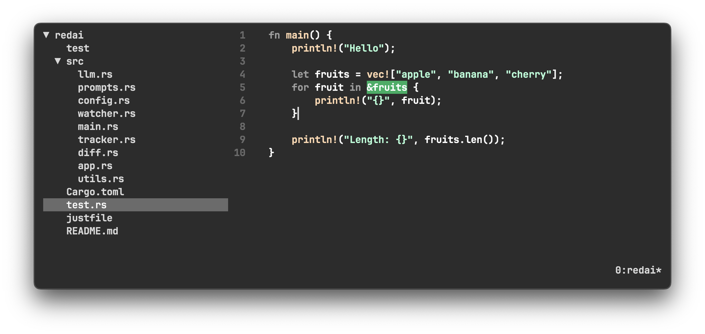

# redai

A terminal-based AI-powered code editor for developers, written in Rust.

redai combines a fast, modern TUI code editor with context-aware code completion and editing powered by large language models (LLMs) such as OpenRouter/CodeStral. It is designed for productivity, code navigation, and seamless AI-assisted coding directly from your terminal.



## Features

- **Terminal UI**: Fast, responsive code editor with file tree navigation using [ratatui].
- **AI Code Completion & Editing**: Context-aware suggestions and code edits using LLMs (OpenRouter, CodeStral, etc.).
- **File Tree**: Browse and open files in your project directory.
- **Keyboard & Mouse Support**: Navigate, edit, and resize panes with keyboard and mouse.
- **Visual Diff**: Visualize code changes and AI-suggested edits.
- **Configurable**: Set your LLM provider, model, and API key via environment variables.

## Installation
### From releases

Linux:
```bash
curl -L https://github.com/vipmax/redai/releases/latest/download/redai-linux.tar.gz | tar -xz --overwrite
sudo mv redai /usr/local/bin/
sudo chmod +x /usr/local/bin/redai
redai
```

Macos:
```bash
curl -L https://github.com/vipmax/redai/releases/latest/download/red-universal-apple-darwin.tar.gz | tar -xz --overwrite
sudo mv redai /usr/local/bin/
sudo chmod +x /usr/local/bin/redai
redai
```

### From sources
1. **Clone the repository:**

```sh
git clone https://github.com/yourusername/redai.git
cd redai
```

2. **Install Rust (if not already):**

https://rustup.rs/

3. **Build the project:**

```sh
cargo build --release
```

4. **Set up environment variables:**

Create a `.env` file or export variables in your shell:

```
OPENROUTER_API_KEY=your_openrouter_api_key
OPENROUTER_BASE_URL=https://openrouter.ai/api/v1   # (optional, default shown)
OPENROUTER_MODEL=mistralai/codestral-2508     # (optional, default shown)
```

## Usage

Run redai with a file to edit:

```sh
cargo run --release -- path/to/your_file.rs
```

Or just run `redai` to open the default file (`test.rs`).

### Key Features

- **File Tree Navigation:**
  - Use arrow keys or mouse to navigate files and folders.
  - Press `Enter` to open a file.
  - `q` to quit file tree, `Esc` to deselect.
- **Editor:**
  - Edit code as in a normal editor.
  - `Ctrl+S` to save.
  - `Ctrl+Space` to trigger AI autocomplete/code edit at the cursor.
  - `Esc` to undo marks or quit.
  - `Control + c` - copy 
  - `Control + v` - paste  
- **AI Code Editing:**
  - The editor sends code context and recent edits to the LLM.
  - The LLM responds with precise code changes, which are applied and visualized.

## AI Completion: How It Works

When you trigger AI completion (with `Ctrl+Space`), redai:

1. **Gathers Context:**
   - Captures a small and large context window around your cursor.
   - Includes a summary of your recent edits for better continuity.
2. **Sends to LLM:**
   - Packages the context and recent activity into a prompt.
   - Sends this to the configured LLM (e.g., OpenRouter/CodeStral).
3. **LLM Responds:**
   - The LLM returns a response in a strict format using special tokens:
     - `<|SEARCH|>`: The code to find (with `<|cursor|>` marking your cursor).
     - `<|DIVIDE|>`: Separates the search and replacement.
     - `<|REPLACE|>`: The replacement code.
   - Example:
     ```
     <|SEARCH|>let <|cursor|> = 10;<|DIVIDE|>let x = 10;<|REPLACE|>
     ```
4. **Applies the Edit:**
   - redai parses the LLM's response, computes the minimal edit, and applies it to your code.
   - The change is visually highlighted in the editor for review.

This approach ensures that completions are context-aware, minimal, and easy to review, making AI assistance both powerful and safe.

## Configuration

redai is configured via environment variables:

- `OPENROUTER_API_KEY` (**required**): Your OpenRouter API key.
- `OPENROUTER_BASE_URL` (optional): LLM API endpoint. Default: `https://openrouter.ai/api/v1`
- `OPENROUTER_MODEL` (optional): LLM model name. Default: `mistralai/devstral-medium-2507`

You can use a `.env` file in the project root for convenience.

## Dependencies

- [ratatui](https://github.com/ratatui-org/ratatui) - Terminal UI
- [ratatui-code-editor](https://github.com/vipmax/ratatui-code-editor) - Code editor widget
- [async-openai](https://github.com/64bit/async-openai) - OpenAI-compatible LLM client
- [crossterm](https://github.com/crossterm-rs/crossterm) - Terminal input/output
- [tokio](https://tokio.rs/) - Async runtime
- [similar](https://github.com/mitsuhiko/similar) - Diffing
- [serde, serde_json] - Serialization
- [tui-tree-widget](https://github.com/ratatui-org/tui-tree-widget) - File tree navigation

## Acknowledgments

- Inspired by modern code editors and the power of LLMs for code assistance.
- Uses [OpenRouter](https://openrouter.ai/) for LLM backend.

---

MIT License. Contributions welcome! 